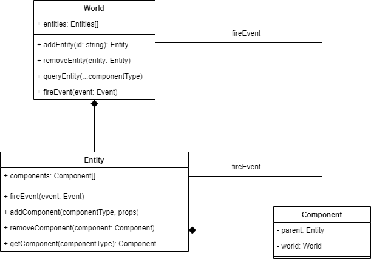

# DIG Game

A social experiment on what would happen if we forced a group of friends together in a really hazardous mine and asked them to become rich or die trying. Just remember, [losing is fun](https://dwarffortresswiki.org/index.php/DF2014:Losing)!

## Setup Local enviroment

Requirement:
 - [NodeJS / NPM](https://nodejs.org/en)

Running:

 - Clone the repo
 - Install the packages
   -  Run `npm install` inside both the `client` and the `server` folder
 - Start the server
   - Run `npm run start:dev` inside the `server` folder
   - OR run `npm run start:server` in the repo root
 - Start the client
   - Run `npm run start:dev` inside the `client` folder
   - OR run `npm run start:client` in the repo root
 - The game now should be running on `localhost:8080`, so just open it up using your preferred browser

## Architecture

See this [video](https://www.youtube.com/watch?v=U03XXzcThGU)
for referenceon what I've based off most of the things.



### World

Singleton in a sense, this stores and handles entities. 

### Entity

An entity can be thought of as a collection of components.

We can then define blueprints for each kind of entity and instantiate them using their `blueprintId`

### Component

A highly specific piece of code and system. It could also just be a Tag without any body (`PlayerTagComponent`, `TileTagComponent`) which could help us identify/query entities, or it could also store data.

Although it's not required, a best practice would be for them to not to rely on any other components. Instead they should be open for events.

### Event System

Components should communicate with eachother only through events when possible. This adds a layer of flexibility, since we don't tightly connect two components together. Instead, the component might send out an `onMove({x, y})` event, to which other components can react to.

The event listeners may modify the arguments, add extra data, or even call new events.

For example

```js
player.OnHit({target});

HeldItem.OnHit({target}); // Add damage

PlayerStats.OnHit({target, dmg}); // Increase dmg from stats

Effects.OnHit({target, dmg}); // Increase dmg if we have a certain effect

...
```


## Creating a component

It is not required to have the `.component` suffix in the filename, however I plan on generating the component registry during the build step, and this convention would help out a ton there.

Snippet:
```ts
// Test.component.ts
export class TestComponent {
	// During the build step, the class names gets scrambled, so as of now
	// we have to define a unique ID for the component type
	// Later on, I want to generate these IDs during the build step
	static readonly COMPONENT_ID = "TestComponent" as const;
}
```

Insert the component to the `registry.ts`
```ts
import { TestComponent } from "./TestComponent.component";

export function registerComponents() {
	// ...
	registerComponent(TestComponent);
}
```

Data:

```ts
export class TestComponent {
	// Just add the properties here
	_message: string = "";

	// In some cases we can't set a default value, in those cases 
	// we can either use '?' or '!'
	//   ?: It might be null, have to nullcheck it when using it
	//   !: Tells Typescript that "we know what we're doing" and will 
	//         assign a value to it before accessing it 
	offsetX?: number;
	sprite!: Sprite;

	// you can also define getters/setters
	get message() {
		return this._message;
	}
	set message(value) {
		this._message = value;
	}
}
```


Behaviour:

```ts
export class TestComponent {
	// We can listen to events by just implementing their 
	// corresponding  functions
	onInit(props) {
		console.log("TestComponent initialized");
	}

	onLateInit(props) {

	}

	// Will listen execute on
	//  entity.fireEvent(baseEvent("onDebug", { message: "Hello World" }))
	onDebug(props) {
		props.message = `[DEBUG] ${props.message}`;
	}
}
```

## Creating Entity Blueprints

Create the file `Test.entity.xml` 
```xml
<Entity id="Test">

</Entity>
```

Add components based on the behaviour. In the future I'm hoping that we'll have a small description of each component. Try to think through what the object is, and add the ones that are related to what you want.
```xml
<Entity id="Test">
	<TestComponent />
	<SpriteComponent />
</Entity>
```

Fine tuning.
You can define props that can modify the behaviour of the component. Again I hope that we'll have a documentation on what properties each component can have. For now you can check other entities, or the component's source code .
```xml
<Entity id="Test">
	<TestComponent message="Hello Miners" />
	<SpriteComponent src="assets/textures/dirt.png" layer="background" />
</Entity>
```

Add it to the [entity registry](./client/src/entities/registry.ts)

```ts
export async function registerEntityBlueprints() {
	// ...
	await loadEntityBlueprint(`assets/entities/Test.entity.xml`);
}
```

## GameConfig

It currently defines a couple of things, but some good to remember values are:
|  | Value | Desc |
|--|--|--|
| gridSize | 16 | 1 tile is 16px |
| chunkSize | 16 | 1 chunk is 16 tiles |
| renderLayers | see below | The possible layers a sprite can be on | 


```ts
// If needed, we can define more later down the line,
//  but for now these ones should do
[
	"farBackground", // Below everything
	"background",
	"default",
	"entity",
	"tile",
	"foreground",
	"farForeground",
	"UI", // Above everything
]
```

## Networking

soon<sup>tm</sup>